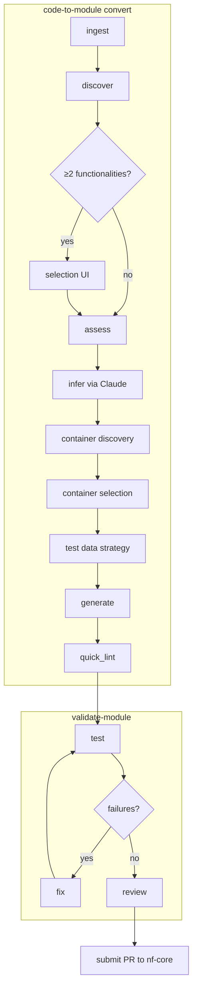

# Architecture

## What this tool does

`code-to-module` converts a script or Git repository into a submission-ready
nf-core module directory. The conversion pipeline is a linear sequence: ingest the
source, discover distinct CLI entry points, assess complexity, call Claude to infer
channel names and the shell command, resolve a container, choose a test data strategy,
and render the module files from Jinja2 templates. The result is a `main.nf`,
`meta.yml`, `environment.yml`, and nf-test spec that the author reviews before
submitting to nf-core.

The tool is LLM-assisted, not fully autonomous. Claude handles only the inference
step — reading source code and optional documentation to determine what the module's
inputs, outputs, and shell command should be. Everything else is deterministic: rule-
based discovery, API-backed container resolution, schema-driven generation. The output
is best-effort; structural invariants (meta as first input, eval() version capture,
ext.args wiring) are enforced by post-processing guards, but output glob patterns and
process labels need human review before submission.

## Module map

| File | Purpose | Key exports |
|------|---------|-------------|
| `ingest.py` | Accepts file paths, directories, Git URLs; fetches `--docs` content | `ingest() → CodeSource` |
| `discover.py` | Rule-based then LLM-based functionality detection; interactive selection UI | `discover(), select_functionalities() → DiscoveryResult` |
| `assess.py` | Assigns Tier 1–5 complexity to each FunctionalitySpec | `assess() → (tier, confidence, warnings)` |
| `infer.py` | Calls Claude API on one FunctionalitySpec; enforces post-processing invariants | `infer() → ModuleSpec` |
| `container.py` | Two-phase: discover all container options in parallel, then select one | `discover(), select() → ContainerOption` |
| `bioconda.py` | Checks Bioconda for existing packages; generates meta.yaml recipe scaffolds | `check_bioconda(), generate_recipe()` |
| `test_data_match.py` | Strategy 1: matches channel specs to nf-core/test-datasets files | `match_test_data() → list[ChannelTestData]` |
| `test_data_derive.py` | Strategies 2a/2b: derives test data or chains an upstream nf-core module | `derive_test_data(), chain_test_data()` |
| `test_gen.py` | Orchestrates test data strategy selection; produces TestSpec and `derive_test_data.sh` | `generate_test_spec() → TestSpec` |
| `generate.py` | Renders Jinja2 templates into module files; applies post-processing fixes | `generate_module() → list[Path]` |
| `quick_lint.py` | Fast structural checks after generation (no subprocess) | `quick_lint() → list[LintWarning]` |
| `validate.py` | Runs `nf-core modules lint` and `nf-test`; classifies failures A/B/C | `run_validation() → TestReport` |
| `fix.py` | Proposes rule-based (A) and LLM-assisted (B) fixes as diffs; applies on approval | `propose_fixes(), apply_approved_fixes()` |
| `review.py` | Static analysis against nf-core style conventions | `review_module() → ReviewReport` |
| `models.py` | All Pydantic v2 data models shared across the pipeline | `CodeSource, ModuleSpec, TestSpec, ContainerOption, …` |
| `api.py` | Clean programmatic API wrapping the full pipeline; no Rich output | `convert() → dict` |
| `cli.py` | `code-to-module` Click group: convert, assess-only, containers, bioconda-recipe, update-standards | — |
| `validate_cli.py` | `validate-module` Click group: test, fix, review | — |
| `regression.py` | Parses generated modules and scores them against nf-core reference modules | `parse_module(), score_module()` |
| `standards/loader.py` | Loads and caches `nf_core_standards.json`; exposes the Standards singleton | `get_standards() → Standards` |

## The conversion pipeline



**ingest** accepts a local file path, directory, or Git URL, clones if necessary, and
builds a `CodeSource` containing the repo manifest and any documentation fetched via
`--docs`. It also parses `--existing-modules` directories so downstream stages can
align container URLs and channel conventions to modules already in use.

**discover** is deliberately split from assess and infer. Rule-based detectors run
first (Click/Typer decorators, argparse subparsers, shell `case` dispatch, multiple
top-level scripts) because they are fast and deterministic. The LLM fallback only fires
when rule-based detection finds zero or one functionality. This keeps discovery
reproducible: two runs on the same repo produce the same `FunctionalitySpec` list
regardless of LLM non-determinism.

**assess** assigns a complexity tier (1–5) to each `FunctionalitySpec`. Tier drives
the default container strategy and determines how much of the module can be completed
automatically — Tier 5 means generation cannot proceed and the user is told why.

**infer** is the only step that calls the Claude API. It sends the relevant code
section plus any documentation to Claude and receives back channel names, types, and
the shell command. Post-processing guards then enforce structural invariants that Claude
is not expected to get right every time: `val(meta)` as the first input, the `eval()`
version capture pattern, and no `TODO` placeholders in required fields.

**container discovery and selection** run as two separate phases. Discovery runs all
checks in parallel (Dockerfile in repo, `environment.yml`, `requirements.txt`,
Singularity.def, Bioconda/BioContainers API) and collects every available option. No
check is skipped because a better one was found. Selection then applies the tier-aware
default order — BioContainers ranks first for Tier 1–2 tools, repo files rank first for
Tier 3–5 — or presents an interactive menu on a TTY.

**test data strategy** tries four strategies in priority order until one succeeds for
each input channel. See [Test data strategies](#test-data-strategies) below.

**generate** renders the module files from Jinja2 templates, then **quick_lint** runs
a fast structural check in-process. Any warnings are surfaced in the CLI summary
without requiring `nf-core lint` to be installed.

## The validation pipeline

`validate-module test` runs `nf-core modules lint` and `nf-test` against a module
directory, captures their output, and classifies each failure into one of three
classes. **Class A** failures have deterministic structure — wrong emit name, missing
`topic: versions` tag, container URL prefix error, missing `ext.args` pattern — and
can be fixed by a deterministic rule. **Class B** failures require reading the module
in context — wrong output glob, wrong process label — and are addressed by an
LLM-assisted fix with a lower trust signal. **Class C** failures cannot be resolved
automatically; the tool explains what is wrong and stops.

`validate-module fix` presents each fixable failure as a coloured diff panel labelled
with its source (`[rule]` or `[llm]`) and waits for explicit approval before writing
anything. This is non-negotiable: silent file modification would make the fix command
a liability rather than an aid. After applying approved fixes, validation re-runs
automatically to confirm the failures are resolved.

`validate-module review` performs static analysis only — no subprocess calls, no
nf-test execution. It checks channel naming conventions, process label
appropriateness, `ext.args` usage, `meta.yml` completeness, versions channel structure,
and EDAM ontology coverage, returning a `ReviewReport` with ERROR / WARNING / INFO
severity levels.

## The import boundary (critical for contributors)

The codebase is split into two strictly separated halves:

```
┌─────────────────────────────────┐   ┌──────────────────────────────────┐
│     Conversion pipeline         │   │      Validation suite            │
│                                 │   │                                  │
│  ingest → discover → assess     │   │  validate.py                     │
│  → infer → container            │   │  fix.py                          │
│  → test_gen → generate          │   │  review.py                       │
│                                 │   │  validate_cli.py                 │
│  cli.py  api.py                 │   │                                  │
└─────────────────────────────────┘   └──────────────────────────────────┘
         ↑                                        ↑
         │            standards/                  │
         └──────────── (shared) ─────────────────┘
```

`validate_cli.py` must never import from `ingest`, `discover`, `assess`, `infer`,
`container`, `test_gen`, or `generate`. `standards/` must never import from any
sibling module in either half. This boundary exists so the validation suite can be
extracted into a standalone `nf-module-tools` package later without renaming
anything. A test enforces it: `pytest tests/test_import_boundaries.py`. If you add
an import and this test fails, the boundary has been violated — restructure rather
than loosen the rule.

## nf-core conventions enforced by the generator

These are applied automatically. Contributors do not need to implement them manually,
but should know they exist when reviewing generated output.

| Convention | Where enforced | Reference |
|------------|---------------|-----------|
| `val(meta)` as first input channel | `infer.py` post-processing guard | nf-core module template |
| `eval()` version capture pattern | `main.nf.j2` template | fastqc, samtools/sort modules |
| Both Singularity and Docker container URLs | `container.py` + `main.nf.j2` | nf-core container policy |
| `topic: versions` on versions output channel | `main.nf.j2` template | nf-core 3.5+ convention |
| All params via `ext.args` (none hardcoded) | `main.nf.j2` template | nf-core module guidelines |

Full specification: [nf-co.re/docs/guidelines/components/modules](https://nf-co.re/docs/guidelines/components/modules)

## The standards schema

`src/code_to_module/standards/data/nf_core_standards.json` is the single source of
truth for all nf-core conventions used by the generator — valid process labels,
container registry URLs, required `meta.yml` fields, EDAM ontology mappings, test
dataset paths, and derivation templates. Nothing in Python code or Jinja2 templates
should hardcode an nf-core convention directly; it must come from the schema via
`get_standards()`. This makes convention updates a one-file change. To update the
bundled schema, edit `nf_core_standards.json`, bump `schema_version`, add an entry
to `STANDARDS_CHANGELOG.md`, and run `code-to-module update-standards` to check
whether the remote schema has a newer version.

## Test data strategies

The generator tries strategies in this order and stops at the first match for each
input channel.

| Strategy | When used | Output |
|----------|-----------|--------|
| 1 — Match | A file of the right format already exists in nf-core/test-datasets | Path reference in `main.nf.test` |
| 2a — Derive | No exact match; file can be subsetted or transformed from existing nf-core data | `derive_test_data.sh` + path reference |
| 2b — Chain | Input is the natural output of a known upstream nf-core module | `setup {}` block in `main.nf.test` |
| 3 — Stub | Data is too large, proprietary, or cannot be derived | `stub:` block; tests run with `nf-test --stub` |

Derive (2a) is intentionally ranked above chain (2b). A stored file keeps CI test
runtime predictable; a `setup {}` block runs an upstream module on every test
invocation, adding latency that nf-core reviewers notice.

## Adding a new feature

The most common contribution patterns, in order:

1. **Adding a new review check** — add a function to `review.py` that accepts a
   module path and `Standards` object and returns a list of `ReviewItem`. Add the
   function to the `review_module()` call chain. Write a test in `tests/test_review.py`
   covering both the pass and fail cases.

2. **Adding a new generated file** — add a `.j2` template to
   `src/code_to_module/templates/`. Add any new data fields to the relevant Pydantic
   model in `models.py`. Update `generate.py` to render the template. Add a test
   fixture and a test in `tests/test_generate.py` that asserts the file is written and
   contains the expected content.

3. **Extending the standards schema** — add the new convention to
   `src/code_to_module/standards/data/nf_core_standards.json`. Bump `schema_version`.
   Add a changelog entry in `STANDARDS_CHANGELOG.md`. Update any code that reads from
   the schema to use the new field via `get_standards()`. Never duplicate the value
   in Python code.

4. **All of the above** — run `pytest -x -q -m "not network and not llm"` after each
   step, and `pytest tests/test_import_boundaries.py` before opening a PR.

## Known limitations and planned improvements

- **Library-only tools** with no CLI entry point (e.g. tools designed to be called as
  `import foo; foo.run(...)`) are not yet supported — discovery finds no entry points
  and generation stops. A `library-to-module` path that generates a CLI wrapper first
  is planned.
- **Perl wrappers and non-Python CLI tools** (TrimGalore, for example) have no Python
  AST to analyse and tend to assess as Tier 4–5. The tool reports the tier honestly
  rather than producing a misleading partial module.
- **Domain-specific test data** (`.h5ad`, `.pkl`, `.mzML`, large databases) is not in
  nf-core/test-datasets, so those input channels fall back to stub strategy. The
  generated test is syntactically valid but cannot test real data flow.

Open issues and the development roadmap are tracked at
[github.com/svigneau/code-to-module/issues](https://github.com/svigneau/code-to-module/issues).
