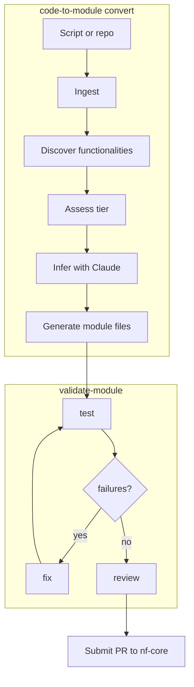

# code-to-module

`code-to-module` automates the blank-file problem in nf-core module authorship.
Point it at a script or Git repository and it generates a complete nf-core module
directory: correct channel structure, BioContainers lookup, nf-test with real or
derived test data, and a review report flagging anything that needs human attention
before submission. The pipeline is LLM-assisted — Claude handles inference from source
code and documentation — but discovery is rule-based, container resolution queries
real APIs, and generation uses fixed templates. The output is a best-effort module
that the author should review before submitting.

## Quick start

```bash
pip install code-to-module
export ANTHROPIC_API_KEY=sk-ant-...

code-to-module convert https://github.com/Teichlab/celltypist \
  --outdir modules/ \
  --no-interaction

validate-module review modules/celltypist/
```

## How it works



## Where to go next

- [User Guide](user-guide.md) — installation, worked example, test data strategies
- [CLI Reference](cli-reference.md) — all options for `code-to-module` and `validate-module`
- [Known Limitations](known-limitations.md) — what the tool cannot yet do, and what to expect from Tier 4–5 tools

---

!!! tip "When to use this tool"
    `code-to-module` works best for **Tier 1–2** tools: CLI tools already in Bioconda
    with clean file-based I/O. For these, it produces a near-complete module with a
    real BioContainers image and matched test data in one command.

    It also handles **Tier 3** tools (custom scripts with an inferrable CLI) and
    generates a draft that needs more review.

    It is not yet suitable for:

    - Library-only tools with no CLI entry point (e.g. Python packages where the
      intended use is `import foo; foo.run(...)`)
    - Tools requiring large proprietary databases (Kraken2, BLAST) — these assess as
      Tier 5 and require manual module authoring
    - Perl wrappers and tools with no detectable CLI structure

    See [Known Limitations](known-limitations.md) for details.
